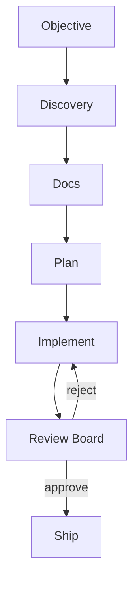

<p align="center">
  <picture>
    <source media="(prefers-color-scheme: dark)" srcset="assets/hydra-logo-dark.png">
    <source media="(prefers-color-scheme: light)" srcset="assets/hydra-logo-light.png">
    
  </picture>
</p>

<p align="center">
  <strong>Multi-agent autonomous development loop for Claude Code</strong><br>
  Discovery &bull; Planning &bull; Implementation &bull; Review &bull; Repeat
</p>

<p align="center">
  
  
  
  
</p>

<br>

---

Hydra runs a complete autonomous SDLC pipeline — from scanning your codebase to shipping reviewed code — with up to 29 specialized agents.

## What Hydra Does

- **Auto-detects your project** — classifies it (greenfield, brownfield, bugfix, refactor, migration) and tailors the pipeline
- **Generates docs before code** — PRDs, TRDs, and ADRs so agents build with context
- **Multi-agent review board** — Architect, Security, Code Quality + project-specific reviewers must ALL approve every task
- **Survives interruptions** — checkpoints, recovery pointers, and session hooks mean you can close your laptop and resume later



## Install

```bash
git clone https://github.com/Strumtry/ai-hydra.git
claude --plugin-dir /path/to/ai-hydra
```

To load automatically, add to `~/.zshrc` or `~/.bashrc`:
```bash
alias claude='claude --plugin-dir /path/to/ai-hydra'
```

## Quick Start

> [!TIP]
> **3 commands to get started:**
> ```bash
> /hydra:init            # Set up Hydra for your project
> /hydra:start           # Start the autonomous loop
> /hydra:status          # Check progress anytime
> ```

Hydra auto-detects project state: active work resumes, existing docs trigger planning, fresh projects scan for TODOs/issues/failing tests. Override with `/hydra:start "specific objective"`.

> [!WARNING]
> **Autonomous mode** skips all permission prompts:
> ```bash
> claude --dangerously-skip-permissions
> /hydra:start --yolo --max 30
> ```

## Commands

| Command | Description |
|---------|-------------|
| `/hydra:init` | First-time setup: discovery, reviewer generation, runtime dirs |
| `/hydra:start` | Smart start/resume — auto-detects state, derives objective |
| `/hydra:status` | Check loop progress, task counts, reviewer board |
| `/hydra:pause` | Gracefully pause at next iteration boundary |
| `/hydra:task` | Task lifecycle: skip, unblock, add, prioritize, list |
| `/hydra:review` | Manually trigger review for a task |
| `/hydra:log` | View run history — iterations, commits, reviews |
| `/hydra:board` | Connect task tracking to GitHub Projects |
| `/hydra:docs` | View or regenerate project documents |
| `/hydra:enhance` | Research Claude Code releases, propose Hydra improvements |
| `/hydra:help` | Quick reference for all commands and modes |

See `/hydra:help` for the full command list and all flags.

## How It Works

Hydra runs a pipeline of specialized agents. Discovery scans your codebase and classifies the project. The Doc Generator creates foundational documents. The Planner decomposes your objective into dependency-ordered tasks. The Implementer builds each task (delegating to specialists like Frontend Dev, DevOps, or DB Migration as needed). A Review Board of 3-13 reviewers must unanimously approve each task before it advances. The loop continues until every task is done, then Post-Loop agents handle documentation, releases, and observability.

See [Architecture](docs/ARCHITECTURE.md) for the full agent roster, pipeline details, and recovery system.

## Requirements

- `jq` — Required for JSON manipulation in hook scripts
- `git` — Required for commit tracking and state persistence
- Claude Code — Agent Teams is enabled automatically by `/hydra:init`

## Learn More

- [Architecture](docs/ARCHITECTURE.md) — Pipeline, agent roster, recovery, directory structure
- [Configuration](docs/CONFIGURATION.md) — Start flags, local mode, board sync
- [Safety & Rules](docs/SAFETY.md) — The 10 rules, guardrails, troubleshooting
- [Plugins](docs/PLUGINS.md) — Companion plugins, compatibility matrix, OpenClaw

## License

MIT
